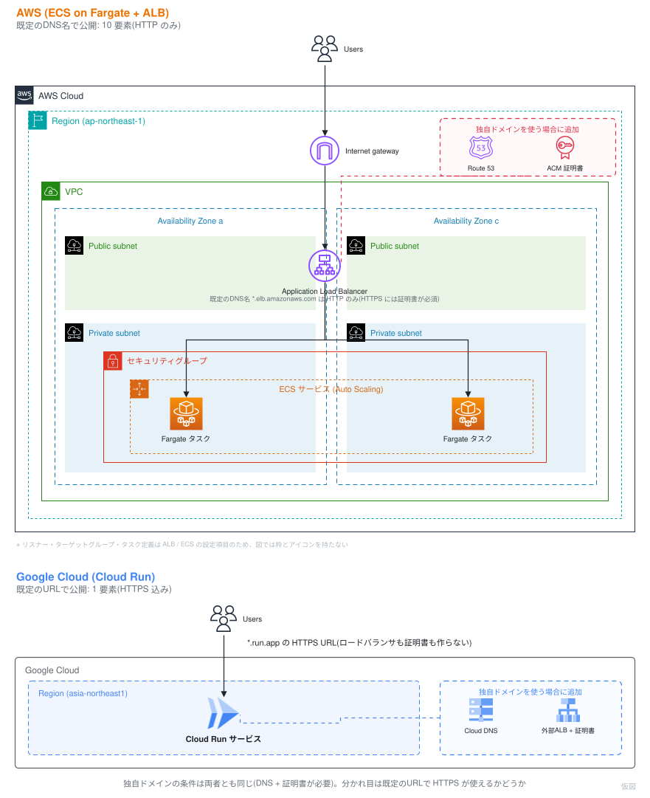

# 1. AWSとGoogle Cloudの考え方の違い

## ビルディングブロック vs SaaS的アプローチ

AWS の思想は**ビルディングブロック**です。  
VPC・サブネット・セキュリティグループ・IAMロール・ALB・ターゲットグループ……小さな部品を積み上げて、自分のアーキテクチャを組み立てます。  
自由度が高い一方で、「Webアプリを1つ公開する」だけでも組み立てる部品の数は多くなります。  
そしてこの部品の数は、作るときだけの話ではありません。動かしたあとに設定を読み、壊れたときに開く対象の数にもなります。

Google Cloud のマネージドサービスは、どちらかというと **SaaS 的なアプローチ**です。  
「Webアプリを公開したい」という目的に対して、統合済みのサービスが1つ用意されていて、デフォルトで実用的な設定になっています。  
部品を組む代わりに、完成品の設定を必要な分だけ調整します。調整できる範囲は狭くなりますが、覚えるつまみの数も少なくなります。

この違いが一番わかりやすいのが、今回扱う Cloud Run です。  
まずは「コンテナを1つ、HTTPSで公開するまで」に必要なものを並べ、そのあとに運用の目線でもう一度見比べます。

### 例: コンテナを1つ、HTTPSで公開するまで

| | AWS (ECS on Fargate + ALB) | Google Cloud (Cloud Run) |
|---|---|---|
| ネットワーク | VPC・サブネット・SG を用意 | 不要(必要なら後から VPC 接続) |
| 負荷分散 | ALB + ターゲットグループ + リスナー | 不要(組み込み) |
| TLS証明書 | HTTPSリスナーには証明書が必須。ALB の既定DNS名(`*.elb.amazonaws.com`)は HTTP のみ | 不要(`*.run.app` のHTTPS URLが自動発行) |
| オートスケール | Application Auto Scaling を設定 | デフォルトで有効(0台〜既定100台) |
| ログ | awslogs ドライバや FireLens を設定 | 不要(stdout が自動で Cloud Logging へ) |
| デプロイ | タスク定義 + サービス更新 | `gcloud run deploy` 1コマンド |
| 独自ドメイン | Route 53 等のDNS + ACM 証明書 | Cloud DNS 等のDNS + 外部ALBと証明書(ドメインマッピングは限定提供) |

表の「不要」は「自分で作らなくてよい」という意味で、「設定できない」ではありません。  
同時実行数・CPU割り当て・min/maxインスタンスのように、Cloud Run 側にも調整するつまみはあります(7章)。

**独自ドメインの条件は両者で同じです。** どちらもドメインを自分で用意し、DNSレコードを設定し、証明書を用意する必要があります。  
違うのは**既定で払い出される URL で HTTPS が使えるか**です。Cloud Run の `*.run.app` は HTTPS 込みですが、ALB の既定DNS名は HTTP のみで、HTTPS リスナーを作るには証明書が必須です([AWS: Create an HTTPS listener](https://docs.aws.amazon.com/elasticloadbalancing/latest/application/create-https-listener.html))。証明書はドメイン名と一致していなければならないため、実質「所有ドメインが前提」になります。

どちらが優れているという話ではありません。  
細かく制御したいなら AWS 的なアプローチが強く、素早く価値を出したいなら Google Cloud 的なアプローチが強い。  
両方の目線を持っていると、状況に応じて最適な選択ができる——それが今日のゴールです。

> **[要作図] 図1: 運用で向き合うプロダクトの数**
>
> - **目的:** 教材全体の主題を「作るときの手数」ではなく「**運用で理解が必要なプロダクトの数**」として見せる。この図がこの教材でいちばん重要
> - **構図:** 上下2段(上=AWS、下=Cloud Run)。上段は AWS Cloud / Region / AZ / VPC / サブネットの入れ子フレームの中に ECS サービス・Fargate タスク・ALB・セキュリティグループ・Application Auto Scaling を置く。下段は「Cloud Run サービス」1つと、そこから出る `*.run.app` の HTTPS URL
> - **塗り分けが主張の中心:** 「**自分が設定を読み、障害時に開くプロダクト**」を濃い色、「プラットフォームが持っていて開く必要のないもの」を薄い色にする。**数えてほしいのは箱の総数ではなく濃い箱の数**
> - **数の対比:** 「既定のDNS名・URLで公開する場合」に限って 10 対 1。**この前提を図中に明記する**(前提を書かないと不公平な比較になる)
> - **リスナー・ターゲットグループ・タスク定義:** ALB / ECS の設定項目で構成図上に描く場所がないため図中の注記で補う。ただし**障害時に実際に読むもの**なので注記から落とさない
> - **注意:** 「Google Cloud のほうが優れている」と読ませない。「自由度をプラットフォームへ渡した結果」という趣旨の一文を**画像の中に**入れるとトレードオフとして読める(Markdown 側にキャプション文は置かない)
> - **完成後の扱い:** `01_aws_and_googlecloud/imgs/aws-vs-cloudrun-building-blocks.svg` として保存し、**見出しの直下**に `` として差し込む(見出し → 画像 → 本文の順。キャプション文は付けない)
> - **現在の状態:** 上に差し込まれているのは**仮図**です(右下に「仮図」と入っています)。draw.io で作図し、AWS 公式アーキテクチャアイコンと入れ子フレーム、Google Cloud 公式アイコンを使っています。SVG に編集元の XML を埋め込んであるため、**このファイルをそのまま draw.io で開いて編集できます**
> - **ドメイン条件の公平性:** 当初版は ACM を AWS 側にだけ置いており、実質「独自ドメインありの AWS」対「独自ドメインなしの Cloud Run」を並べる不公平な図でした。現在は**両側に「独自ドメインを使う場合に追加」の破線グループ**(AWS: Route 53 + ACM / Google Cloud: Cloud DNS + 外部ALBと証明書)を置いて条件を揃えています。**この対称性を崩さないでください**——崩すと図がどちらか一方に有利な比較になります
> - **8章の図8 との関係:** 共有するのは**配色と塗り分けの規則**(自分で用意したもの・自分が開くもの=濃い色)です。配置は図1が上下2段、図8が左右で異なってかまいません。以前この欄にあった「図8 も同じ左右配置を使う」という記述は、図1 を構成図に変更した時点で成り立たなくなったため撤回します

### 注記: 1コマンドで立つ経路は AWS にもある

ここまで部品の数を並べましたが、「最初の1コマンドで公開できるか」はもう両クラウドの差ではありません。  
2025年11月に GA した **ECS Express Mode** は、1回の API 呼び出しで ECS クラスタ・タスク定義・サービス・ALB(HTTPSリスナー・リスナールール・ターゲットグループ)・セキュリティグループ・サービスリンクロール・Application Auto Scaling・ロググループ・メトリクスアラーム・ACM証明書 を作り、`https://<service>.ecs.<region>.on.aws` の HTTPS URL を返します([AWS: Resources created by Amazon ECS Express Mode services](https://docs.aws.amazon.com/AmazonECS/latest/developerguide/express-service-work.html))。  
用意するのはコンテナイメージと IAM ロール2つだけで、Express Mode 自体に追加料金はありません。

ただし、作られた10種類は**自分のアカウントのリソース**です。

- 壊れたときに読むのは、これまでどおり ALB のアクセスログ・ターゲットグループのヘルス状態・タスクの停止理由
- ALB の設定とデプロイ戦略は Express Mode の API からは変更できず、独自ドメインは API の外で ALB を直接編集する
- VPC 内で最初に作った Express Mode サービスが、その VPC の ALB のスキームとアベイラビリティゾーンを決める。ALB は最大25サービスで共有される
- 既定値のうち確認しておきたいもの: ALB のアクセスログは無効、Desync 緩和モードは無効、パブリックサブネットではタスクにパブリックIPが付く
- オートスケールの既定は CPU使用率60%目標で、最小1タスク・最大20タスク

AWS 自身がこう書いています。「Instead of managing **hundreds of configuration parameters across multiple services**」。  
つまり設定項目は消えていません。既定値が入っただけです。しかも既定値の一覧は「Express Mode から変えられるもの」と「**変えたいなら元のサービスへ行くもの**」に分かれています。

**作る手数は減っても、理解する対象は減りません。**  
だからこの教材では、比べる軸を「作るときの手数」ではなく「運用で向き合うプロダクトの数」に置きます。次の節がその比較です。

## 運用で向き合うプロダクトの数

Cloud Run を「ECS + ALB が1つになったもの」と捉えると、いちばん体感が変わるのは障害調査です。  
同じことを知りたいときに、どこを開くかを並べてみます。

| 知りたいこと | AWS (ECS on Fargate + ALB) | Google Cloud (Cloud Run) |
|---|---|---|
| 500 が返る原因の切り分け | ALB のアクセスログ → ターゲットグループのヘルス状態 → ECS のタスク一覧と停止理由 → CloudWatch Logs のログストリーム | 「ログ」タブ(リクエストのログとアプリの stdout が同じ画面に並ぶ・8章) |
| 負荷が増えたときの挙動 | ターゲットグループのメトリクス + Application Auto Scaling のポリシー + ECS のサービスイベント | 「指標」タブのインスタンス数と、同時実行数の設定(7章) |
| 直前の変更を戻す | タスク定義のリビジョンを選び直して ECS サービスを更新 | リビジョン一覧でトラフィックの割り当てを戻す(5章・6章) |
| 権限が足りない | タスク実行ロールとタスクロールを見分ける | サービスに紐づくサービスアカウント1つ |

AWS 側で開いた画面は ECS・ELB・CloudWatch・IAM・Application Auto Scaling に分かれています。  
Cloud Run 側は Cloud Run の画面と、その先の Cloud Logging・Cloud Monitoring だけです。

覚えるつまみも数えられます。今日のハンズオンで触るのは次の範囲です。

- コンテナコントラクト(`PORT` を listen して stdout に出す・2章)
- 同時実行数 / CPU割り当て / min・maxインスタンス / リクエストタイムアウト(7章)
- リビジョンとトラフィック分割(5章・6章)

**公平のために、Cloud Run 側の条件も揃えておきます。**  
「Cloud Run はリソース1つ」が成り立つのは `*.run.app` の URL で公開する場合です。これは Cloud Run の性質というより、Google が管理するドメインを借りていることの性質です。  
独自ドメイン・WAF・複数リージョンへの振り分けといった本番の要件を足すと、Cloud Run の前に外部 ALB を置くことになり、Serverless NEG・バックエンドサービス・URLマップ・ターゲットHTTPSプロキシ・転送ルール・SSL証明書 の6つを自分で組みます([Google Cloud: Serverless NEG の概要](https://docs.cloud.google.com/load-balancing/docs/negs/serverless-neg-concepts))。  
**本番の要件を足せば、Google Cloud 側も部品を組む世界に戻ります。** この章で見せているのは「既定で払い出される URL まで」という同じ条件での比較です。

## アカウント構造の違い

| 概念 | AWS | Google Cloud |
|---|---|---|
| 分離の単位 | アカウント(Organizations の OU で階層化) | **プロジェクト**(組織 > フォルダ > プロジェクトの階層。フォルダは任意) |
| リージョンの扱い | コンソールでリージョンを切り替える | リソース作成時に指定(コンソールは全リージョン横断) |
| 権限の主体 | IAMユーザー / ロール | Google アカウント / **サービスアカウント** |
| API | 常に有効 | プロジェクトごとに**明示的に有効化** |

特に「プロジェクト」は Google Cloud を触るうえで最初に慣れておきたい概念です。  
dev / staging / prod をプロジェクトで分ける、実験用に使い捨てプロジェクトを作る、といった運用が気軽にできます。

## サービス対応表

ハンズオン中に「AWSでいうと何?」と思ったら、ここに戻ってきましょう。

### 今日使うサービス

| Google Cloud | AWSでいうと | 補足 |
|---|---|---|
| **Cloud Run** | ECS Express Mode + ECS on Fargate + Lambda | どれとも微妙に違う。次章で詳しく。App Runner は**新規顧客への提供を終了**しており、AWS は ECS Express Mode への移行を案内している |
| **Artifact Registry (GAR)** | ECR | コンテナ以外(npm, Maven等)も置ける |
| **Cloud Shell** | CloudShell | エディタ付き・Docker が動く(AWS CloudShell も同様。ただし Docker は対応リージョン限定) |
| **Cloud Build** | CodeBuild | ソースデプロイの裏側で動く |
| **Cloud Logging** | CloudWatch Logs | 設定不要で stdout を収集 |
| **Cloud Monitoring** | CloudWatch | メトリクスはデフォルトで収集済み |
| **Pub/Sub** | SNS + SQS | 1サービスで pub/sub もキューも担う |

### 今日は使わないが対応を知っておくと便利なサービス

| Google Cloud | AWSでいうと | 補足 |
|---|---|---|
| Compute Engine | EC2 | |
| GKE | EKS | Kubernetes 発祥の地だけあり完成度が高い |
| Cloud Run functions(旧 Cloud Functions) | Lambda | 現在は Cloud Run 基盤に統合され、名称も Cloud Run functions へ |
| Cloud Storage | S3 | |
| Cloud SQL | RDS | |
| Spanner | Aurora DSQL(2025年5月GA) | グローバル分散RDB。強整合な分散SQLという点で近い |
| BigQuery | Redshift + Athena | Google Cloud 最大の看板サービス |
| Eventarc | EventBridge | 各サービスのイベントを Cloud Run へ配送 |
| Cloud Tasks | SQS(遅延キュー用途) | HTTPターゲットに直接push |
| Cloud Scheduler | EventBridge Scheduler | cron |
| Secret Manager | Secrets Manager | |
| Cloud Load Balancing | ALB/NLB + CloudFront の一部 | グローバル単一エニーキャストIP |
| IAM サービスアカウント | IAM ロール | 「アカウント」だが実体はロールに近い |

## まとめ

- AWS は部品を組み立てる。Google Cloud は完成品を調整する
- **1コマンドで公開する経路はどちらのクラウドにもある。差が出るのは、運用で向き合うプロダクトの数と、壊れたときに開く画面の数**
- ただし Cloud Run の身軽さは `*.run.app` URL の性質。独自ドメインや WAF を足せば外部ALB一式が必要になり、差は縮む
- 分離単位は「アカウント」ではなく「プロジェクト」
- 対応表は読み替えの入口。ただし思想が違うので1対1にはならない——それを体感するのがこの後のハンズオン
