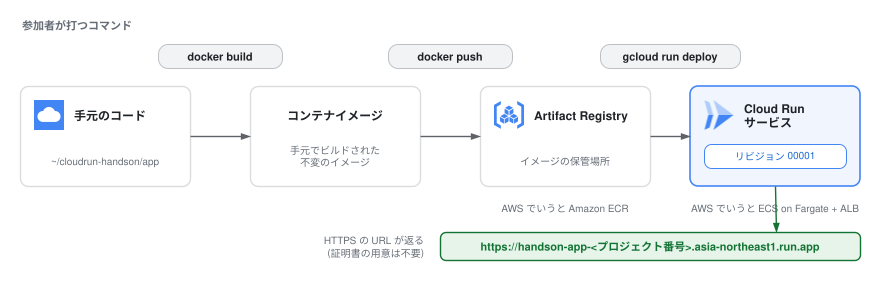

# 4. Cloud Runへデプロイする

2章で作ったイメージを Artifact Registry (GAR)に push し、Cloud Run にデプロイして、世界中からアクセスできる HTTPS URL を手に入れます。

## 0. 環境変数の準備

この先の章でも使うので、まとめて設定しておきます(Cloud Shell が切断された場合はここから再実行してください)。

```bash
export PROJECT_ID=$(gcloud config get-value project)
export REGION=asia-northeast1   # 東京リージョン
export REPO=handson
export IMAGE=${REGION}-docker.pkg.dev/${PROJECT_ID}/${REPO}/app
```

> `asia-northeast1` = 東京です。AWS の `ap-northeast-1` と対応が覚えやすいですね。

## 1. Artifact Registry にリポジトリを作る

ECR と同じく、イメージの置き場をまず作ります。

```bash
gcloud artifacts repositories create ${REPO} \
  --repository-format=docker \
  --location=${REGION} \
  --description="Cloud Run handson"
```

docker コマンドが GAR に push できるよう、認証ヘルパーを設定します(ECR の `aws ecr get-login-password` に相当。こちらは一度設定すれば、push のたびにトークンを取り直す必要はありません)。

```bash
gcloud auth configure-docker ${REGION}-docker.pkg.dev
```

> **成功していれば:** リポジトリ作成が `Created repository [handson].` で終わり、`gcloud artifacts repositories list --location ${REGION}` に `handson` が1行表示されます。認証ヘルパーの設定は `Docker configuration file updated.` で終わります。すでに設定済みの環境では `gcloud credential helpers already registered correctly.` と表示されますが、こちらも成功です。
> **詰まったら:** `ALREADY_EXISTS` は作成済みという意味なので、そのまま次へ進んで構いません。`PERMISSION_DENIED` や API 無効のエラーが出た場合は `gcloud services enable artifactregistry.googleapis.com run.googleapis.com` を実行してから作成コマンドを再実行してください。`${REPO}` や `${REGION}` が空文字で展開されている(コマンドが `create --location=` のように見える)場合は、Cloud Shell の再接続で環境変数が消えています。「0. 環境変数の準備」を再実行してください。

## 2. イメージにタグを付けて push する

GAR のイメージパスは `リージョン-docker.pkg.dev/プロジェクト/リポジトリ/イメージ名:タグ` という形式です。  
2章で作ったイメージにこのパスでタグを付け直して push します。

```bash
cd ~/cloudrun-handson/app
docker tag handson-app:v1 ${IMAGE}:v1
docker push ${IMAGE}:v1
```

push できたか確認してください。

```bash
gcloud artifacts docker images list ${REGION}-docker.pkg.dev/${PROJECT_ID}/${REPO} --include-tags
```

[コンソールの Artifact Registry](https://console.cloud.google.com/artifacts) からも見えます。

> **成功していれば:** `docker push` の最後が `v1: digest: sha256:... size: ...` で終わり、`gcloud artifacts docker images list` の出力に `.../handson/app` の行が1つ表示され、`TAGS` 列が `v1` になっています。
> **詰まったら:** `An image does not exist locally with the tag: handson-app` と出た場合は2章のイメージが手元にありません。`cd ~/cloudrun-handson/app && docker build -t handson-app:v1 .` でビルドし直してから、タグ付けと push をやり直してください(手元のイメージ一覧は `docker images` で確認できます)。`denied` や `unauthorized` が出る場合は `gcloud auth configure-docker ${REGION}-docker.pkg.dev` を実行してから `docker push ${IMAGE}:v1` を再実行します。`echo ${IMAGE}` が空、または `-docker.pkg.dev//` のように途中が抜けている場合は「0. 環境変数の準備」を再実行してください。

## 3. Cloud Run にデプロイする

いよいよ本番です。  
**このコマンド1つで、ECS なら ALB・ターゲットグループ・ACM 証明書・サービス・タスク定義を組み立てていた作業がすべて終わります。**

```bash
gcloud run deploy handson-app \
  --image ${IMAGE}:v1 \
  --region ${REGION} \
  --allow-unauthenticated
```

- `handson-app` がサービス名になります
- `--allow-unauthenticated` は「認証なしで公開」。デフォルトは IAM 認証必須(=閉じている)で、AWS と逆のデフォルトです

30秒ほどで完了し、`Service URL: https://handson-app-<プロジェクト番号>.asia-northeast1.run.app` のような URL が表示されます。

> **成功していれば:** 出力の最後に `Service [handson-app] revision [handson-app-00001-xxx] has been deployed and is serving 100 percent of traffic.` と Service URL が表示されます。URL は `サービス名-プロジェクト番号.リージョン.run.app` という決まった形式です。あとから `gcloud run services describe handson-app --region ${REGION} --format 'value(status.url)'` でいつでも取り直せますが、こちらは `handson-app-<ランダム文字列>-an.a.run.app` という古い形式の URL を返します。**どちらも同じサービスを指す有効な URL** なので、見た目が違っても気にしなくて大丈夫です(6章以降では `describe` で取得した URL をそのまま使います)。
> **詰まったら:** まず `gcloud run services list --region ${REGION}` でサービスが作られているか確認してください。作られていなければエラーの原因を切り分けます。`Image not found` や `manifest unknown` の場合は「2. イメージにタグを付けて push する」の push が完了していないので、`gcloud artifacts docker images list ${REGION}-docker.pkg.dev/${PROJECT_ID}/${REPO} --include-tags` を実行し、`TAGS` 列に `v1` が付いた行があるかを確認してください。`--region` や `--image` が空で怒られる場合は「0. 環境変数の準備」を再実行します。設定を間違えた場合も、同じ `gcloud run deploy` コマンドを何度でも実行し直して大丈夫です(新しいリビジョンが作られて上書きされます)。

## 4. アクセスして確認する



表示された URL をブラウザで開いてください。  
**2章で Cloud Shell の中で見たのと同じ青い画面が、今度は本物のインターネット越しに表示されます。**

2章との違いを見てください:

- `Service` が `handson-app` に、`Revision` が `handson-app-00001-xxx` になっている(Cloud Run が注入する環境変数 `K_SERVICE` / `K_REVISION` をアプリが表示している)
- URL が最初から **HTTPS**。証明書の発行も更新も何もしていない

コンソールの [Cloud Run のページ](https://console.cloud.google.com/run) も開いてみてください。  
サービスの一覧、リビジョン、メトリクス、ログがすべて1画面に集約されています。

> **[要作図] 図3: この章でやったことの流れ**
>
> - **目的:** 4章で打った3コマンドが、どこからどこへ何を運んだのかを1枚で振り返れるようにする。5章以降で何度も戻ってくる基準図になる
> - **描き方:** 手元のコード(`~/cloudrun-handson/app`)→ `docker build` でイメージ →`docker push` で Artifact Registry → `gcloud run deploy` で Cloud Run サービス → `*.run.app` の HTTPS URL
> - **各ステップに添える情報:** そのステップで登場する Google Cloud のサービス名と、AWS での対応(Artifact Registry ↔ ECR など)
> - **補足:** Cloud Run の箱の中に「リビジョン 00001」を小さく描いておくと、5章のリビジョンの話に自然につながる
> - **レイアウトの制約:** 9章のソースデプロイでは `docker build` と `docker push` の2ステップがプラットフォーム側へ移ります。9章の図3b と**並べて差分が読める**ように、箱の位置とレイアウトを固定してください
> - **完成後の扱い:** `04_deploy/imgs/deploy-flow.svg` として保存し、**見出しの直下**に `` として差し込む(見出し → 画像 → 本文の順。キャプション文は付けない)
> - **現在の状態:** 上に差し込まれているのは draw.io で作図した完成図です。SVG に編集元の XML を埋め込んであるため、**このファイルをそのまま draw.io で開いて編集できます**

## ふりかえり: 何をしなかったか

ここまでで「したこと」はリポジトリ作成 → push → deploy の3コマンドです。  
それより「**しなかったこと**」に注目してください。

- VPC・サブネット・セキュリティグループを作らなかった
- ロードバランサーもリスナーも作らなかった
- TLS 証明書を発行しなかった
- タスク定義(CPU/メモリ/ポート)を書かなかった ※デフォルト値で開始し、必要なら後から変える
- キャパシティ(台数)を決めなかった

1章で話した「ビルディングブロック vs SaaS的アプローチ」が、これで体感できたはずです。
