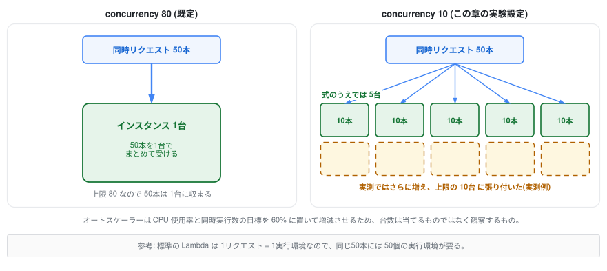
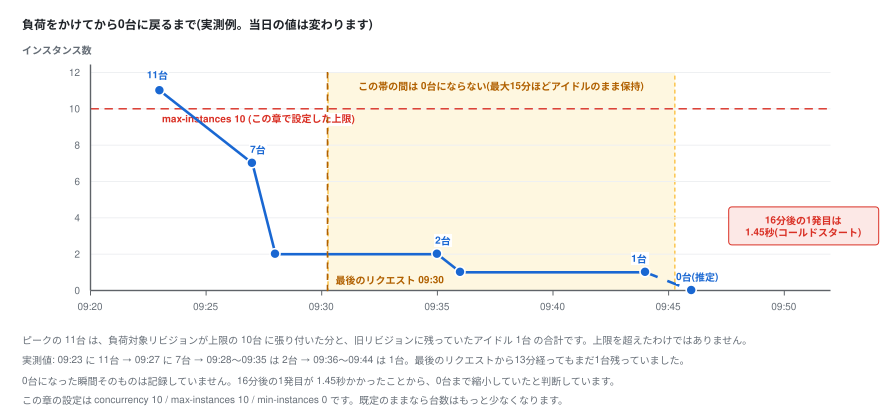

# 7. オートスケールを観察する

Cloud Run の非機能まわりの主役、オートスケールを実際に負荷をかけて観察します。  
あわせてコールドスタートとその対策も体験します。

> オートスケールや非機能要件の背景を体系的に知りたい人は [クラウドを今から学ぶには](https://speakerdeck.com/y0hgi/kuraudowojin-karaxue-buniha) も参照してください。

## Cloud Run のスケールの仕組み



Cloud Run は**同時に処理しているリクエスト数(concurrency)とCPU使用率**を基準にインスタンス数を自動調整します。

```
必要インスタンス数 ≒ 同時リクエスト数 ÷ concurrency(1台が同時に受ける数)
```

- この式は**キャパシティの直感をつかむための概算**です。実際のオートスケーラーは同時リクエスト数とCPU使用率の平均を見て、**どちらも既定で目標値60%以下に収まるように**台数を決めるため、計算どおりの整数台にはなりません(たいてい式より多めの台数になります)
- `concurrency` は1 vCPU構成なら既定80(gcloud / Terraform で新規作成した場合は「vCPU数 × 80」)。1インスタンスあたり最大1000まで上げられます。**標準のLambda(1リクエスト=1環境)と違い、1台で複数リクエストを捌く**
- トラフィックが来なくなると0台までスケールインする(スケールtoゼロ)。ただし縮小は即座ではなく、**次のスパイクに備えて最大15分ほどインスタンスがアイドルのまま残ります**
- ECS のように Application Auto Scaling でスケーリングポリシーを登録する必要はなく、**設定不要で最初から動いている**(ECS もターゲット追跡ポリシーを使えば CloudWatch アラーム自体は AWS 側が自動生成してくれますが、ポリシーを登録する作業そのものは必要です)

> **[要作図] 図6: concurrency とインスタンス数の関係**
>
> - **目的:** 「1インスタンスが複数リクエストを同時に受ける」という Lambda との最大の違いを絵で理解させる
> - **描き方:** 同じ50本の同時リクエストを、2つの設定で受けた場合を左右に並べる
>   - 左: `concurrency 80` — インスタンス1台に50本が束になって入る
>   - 右: `concurrency 10` — 1台が受けるのは10本まで。結果として複数台に分かれる
> - **要点:** 右の台数を「5台」と描き切らないこと。オートスケーラーは目標60%以下に保とうとするため実際は**5台より多くなる**。「式では5台、実測は上限の10台まで増えた」と図中に注記を入れて、**台数は当てるものではなく観察するもの**という本文の姿勢と揃える
> - **注意:** 「実測は上限の10台」は負荷対象リビジョンの台数(active 9 + idle 1)の1回の実測値。当日の値は変わるので、図7 と同様に図中に「実測例」と明記する
> - **比較(任意):** 同じ50本を標準の Lambda で受けた場合(1リクエスト=1環境で50環境)を薄く添えると、コンテナ側の効率が際立つ
> - **完成後の扱い:** `07_scaling/imgs/concurrency-and-instances.svg` として保存し、**見出しの直下**に `` として差し込む(見出し → 画像 → 本文の順。キャプション文は付けない)
> - **現在の状態:** 上に差し込まれているのは draw.io で作図した完成図です。SVG に編集元の XML を埋め込んであるため、**このファイルをそのまま draw.io で開いて編集できます**

## 1. 観察しやすいように設定を変える

デフォルトの concurrency 80 だとなかなかスケールしないので、実験用に1台あたり10接続に絞り、上限を10台にします。

```bash
gcloud run services update handson-app \
  --region ${REGION} \
  --concurrency 10 \
  --max-instances 10
```

> この操作でも新しいリビジョンが作られます。リビジョン=イメージ+**設定**のスナップショットだからです。

## 2. 負荷をかける

負荷試験スクリプトを作ります。  
Node.js の標準APIだけで動く31行のスクリプトで、外部ツールのダウンロードは不要です(Cloud Shell には Node.js が入っています)。

```bash
cat > ~/load.mjs <<'EOF'
// 簡易負荷試験スクリプト。Node.js 標準APIのみで動く(外部バイナリのダウンロード不要)。
//   node load.mjs <URL> [同時接続数=50] [継続秒数=30]
const [url, concurrency = "50", duration = "30"] = process.argv.slice(2);

if (!url) {
  console.error("usage: node load.mjs <URL> [concurrency] [durationSec]");
  process.exit(1);
}

const until = Date.now() + Number(duration) * 1000;
let ok = 0;
let ng = 0;

const worker = async () => {
  while (Date.now() < until) {
    try {
      // タイムアウトを入れないと、サーバー無応答時にワーカーが張り付いて
      // 指定した継続秒数を過ぎても終わらなくなる
      const res = await fetch(url, { signal: AbortSignal.timeout(10000) });
      await res.arrayBuffer(); // レスポンスを読み切って接続を再利用する
      if (res.ok) ok++;
      else ng++;
    } catch {
      ng++;
    }
  }
};

console.log(`load: ${url} concurrency=${concurrency} duration=${duration}s`);
await Promise.all(Array.from({ length: Number(concurrency) }, worker));
console.log(`done: success=${ok} failure=${ng}`);
EOF
```

アプリの `/heavy` は1秒かかる擬似的に重いエンドポイントです。  
同時50接続で30秒間叩きます。

**実行する前に、何台までスケールアウトするか予想してみてください。**  
concurrency を10に絞ったので、1台で受けられる同時リクエストは10。  
50接続なら式のうえでは5台です。

ただしオートスケーラーは同時リクエスト数を目標値(既定60%)以下に保とうとするため、実際には5台より多く、8台前後や上限の10台まで立ち上がることもあります。  
**台数は当てるものではなく観察するものです。**  
予想と違ったら「なぜ?」を考えるのがこの実験の面白いところです。

```bash
URL=$(gcloud run services describe handson-app --region ${REGION} --format 'value(status.url)')

node ~/load.mjs ${URL}/heavy 50 30
```

## 3. 観察する

負荷をかけている間(および直後)に、2つの方法で観察します。

**コンソールで:** [Cloud Run](https://console.cloud.google.com/run) → `handson-app` → 「指標」タブ。  
「コンテナ インスタンスの数」がゼロから跳ね上がり、負荷を止めたあと最大15分ほどかけてまたゼロに戻っていく様子が見えます。  
リクエスト数・レイテンシ(p50/p95/p99)・CPU使用率も**何も設定していないのに**最初から揃っています。

**手元で:** `/api` はインスタンスごとに違う `instance` ID を返します。  
何台に分散しているか数えてください。

```bash
for i in $(seq 1 30); do curl -s ${URL}/api | jq -r .instance; done | sort | uniq -c
```

複数の instance ID が出てくれば、リクエストが複数台に分散している証拠です。  
負荷を止めてから数分〜15分ほど待って同じコマンドを打つと、1台(やがて0台)に戻ります。

> **成功していれば:** `node ~/load.mjs` の最後に `done: success=<数百〜数千> failure=0`(起動中のリクエストが少数失敗することはあります)が表示され、`sort | uniq -c` の出力に **2つ以上の instance ID** が並びます。コンソールの「コンテナ インスタンスの数」もゼロ(または1台)から複数台へ跳ね上がっています。台数は実行ごとに変わるので、5台でなくても失敗ではありません。
> **詰まったら:** `Cannot find module '/home/xxx/load.mjs'` と出る場合は `~/load.mjs` が作られていません。「2. 負荷をかける」の `cat > ~/load.mjs <<'EOF'` から `EOF` までをもう一度そのまま貼り付けて作り直してください(上書きされるので何度実行しても大丈夫です)。`Invalid URL` と出る、または `${URL}` が空の場合は Cloud Shell の再接続で環境変数が消えているので、[4章の「0. 環境変数の準備」](../04_deploy/README.md)を再実行したうえで `URL=$(gcloud run services describe handson-app --region ${REGION} --format 'value(status.url)')` を実行し直し、`echo ${URL}` で URL が表示されることを確認します。instance ID が1種類しか出ない場合は concurrency の変更が効いていない可能性があるので、`gcloud run services describe handson-app --region ${REGION} --format 'value(spec.template.spec.containerConcurrency)'` が `10` を返すか確認し、違っていれば「1. 観察しやすいように設定を変える」を再実行してから負荷をかけ直してください。

## 4. コールドスタートと min-instances



スケールtoゼロの代償が**コールドスタート**です。  
0台の状態への最初のリクエストは、コンテナ起動を待つ分だけ遅くなります。

> **[要作図] 図7: 負荷をかけてから0台に戻るまでのタイムライン**
>
> - **目的:** 「スケールインは即座ではない」という、当日いちばん誤解される挙動を時間軸で見せる。この図があると「10分待っても0台にならない」という詰まりを予防できる
> - **描き方:** 横軸=時間、縦軸=インスタンス数の折れ線グラフ。実測値をそのまま使う
>   - 負荷中のピークは合計11台(負荷対象リビジョンが上限の10台 + 旧リビジョンのアイドル1台)。**上限10台の水平線を引き、旧リビジョンの1台は色を分けて積み上げる**と、上限を超えたわけではないことが伝わります
>   - 負荷停止から約5分後に7台
>   - その後2台まで落ち、**最後のリクエストから13分後もまだ1台残っている**
>   - 16分後の1発目が 1.45秒かかった(コールドスタート)。**0台まで縮小したこと自体は `instance_count = 0` として記録できていない**ので、図では0台の点を破線にして「推定」と明記する
> - **要点:** 「最大15分アイドル保持」の帯を横向きに塗って、**その間は0台にならない**ことを視覚的に示す
> - **注意:** これは1回の実測値。当日の値は変わるので、図中に「実測例」と明記する
> - **完成後の扱い:** `07_scaling/imgs/scale-in-timeline.svg` として保存し、**見出しの直下**に `` として差し込む(見出し → 画像 → 本文の順。キャプション文は付けない)
> - **現在の状態:** 上に差し込まれているのは draw.io で作図した完成図です。SVG に編集元の XML を埋め込んであるため、**このファイルをそのまま draw.io で開いて編集できます**

Cloud Run は最大15分ほどインスタンスをアイドルのまま残すので、0台に戻るのを待つには**15分以上**放置する必要があります。  
講師の説明を聞いたあとなど、しばらく間を置いてから1発目のレスポンスタイムを計ってみてください。

```bash
curl -s -o /dev/null -w "time_total: %{time_total}s\n" ${URL}/
curl -s -o /dev/null -w "time_total: %{time_total}s\n" ${URL}/
```

1回目だけ遅い(このアプリは軽いですが、0台の状態からだと1秒〜1.5秒ほどかかります。重いアプリではさらに長くなります)のがわかります。  
対策は常時1台温めておくことです。

```bash
gcloud run services update handson-app \
  --region ${REGION} \
  --min-instances 1
```

> **トレードオフ:** min-instances を設定した分はアイドル時も課金されます(リクエスト課金の場合、アイドル中は低い単価が適用されます)。「完全従量制(コールドスタートあり)」と「最低台数の固定費(コールドスタートを起きにくくする)」を、**Service ごとにダイヤルで選べる**のが Cloud Run の良いところです。Lambda の Provisioned Concurrency と ECS の常駐、両方の選択肢が1つの Service に入っていると考えてください。なお min-instances は「温かいインスタンスを保つベストエフォート」であり、コールドスタートがゼロになる保証ではありません。

確認できたら、課金を避けるため戻しておきます。

```bash
gcloud run services update handson-app \
  --region ${REGION} \
  --min-instances 0
```

> **成功していれば:** 1回目の `curl` の `time_total` が2回目より明確に大きくなります(このアプリなら1回目が1秒〜1.5秒、2回目は数十ms程度)。`--min-instances` の更新はどちらも新しいリビジョン名を出力して完了し、`gcloud run revisions list --service handson-app --region ${REGION}` の行が増えます。
> **詰まったら:** 1回目と2回目で差が出ない場合は、まだインスタンスがアイドルのまま残っています(Cloud Run は最大15分保持します)。時間を置いて試すか、差が出なくても「温まっていた」ということなので先へ進んでください。リージョンの入力を求められたり `--region` が空だと言われる場合は Cloud Shell の再接続で環境変数が消えているので、[4章の「0. 環境変数の準備」](../04_deploy/README.md)を再実行します。更新が途中で失敗した場合は、同じコマンドをそのまま再実行すれば復旧します。**最後の `--min-instances 0` を実行し忘れるとアイドル時も課金が続きます。**不安なら上のコマンドをもう一度実行して構いません(同じ設定への更新は何度でも安全です)。

## まとめ

- スケールの基準は同時リクエスト数とCPU使用率。台数は「同時リクエスト数 ÷ concurrency」で概算でき、設定ゼロで動く
- スケールtoゼロ ⇔ コールドスタートはトレードオフ。`min-instances` で調整(縮小には最大15分のアイドル時間がある)
- `max-instances` は暴走課金・下流(DB)保護の安全弁としても重要
