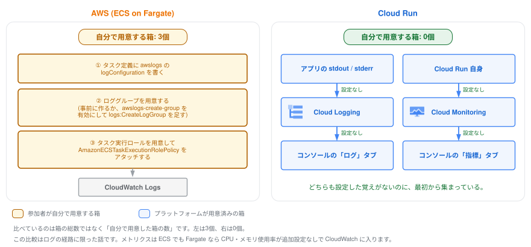

# 8. ログとメトリクスをのぞく



短い章です。  
ここまでのハンズオンで一度も「ログの設定」をしていないのに、実はすべて記録されています。  
それを見に行きます。

> **[要作図] 図8: ログとメトリクスが勝手に集まる経路**
>
> - **目的:** 「設定していないのに記録されている」理由を、経路として示す。1章の主題(消える意思決定)がログの領域でも成り立つことを見せる
> - **左(AWS/ECS):** 同じことをするのに**自分で用意する必要があったもの**を箱で並べる。ラベルは実態に合わせること
>   - ① タスク定義に `awslogs` の `logConfiguration` を書く(常に必須)
>   - ② ロググループを用意する(事前に作るか、`awslogs-create-group` を有効にして `logs:CreateLogGroup` を足す。**既定は無効なので「何もしなくてよい」選択肢はない**)
>   - ③ タスク実行ロールを用意して `AmazonECSTaskExecutionRolePolicy` をアタッチする(`logs:CreateLogStream` / `logs:PutLogEvents` はこの管理ポリシーに含まれるので、**権限を自分で書くわけではない**)
> - **右(Cloud Run):** アプリの stdout / stderr → Cloud Logging → Logs Explorer。並行して Cloud Run 自身 → Cloud Monitoring → 指標タブ。**右の箱はすべて「プラットフォームが用意済み」の色で塗り、参加者が用意した箱は0個であることを凡例で示す**
> - **要点:** 比べるのは箱の総数ではなく「**自分で用意した箱の数**」(左は3個、右は0個)。図1と同じ左右配置(左=AWS、右=Cloud Run)を使うと、教材を通した一貫したメッセージになる
> - **公平性の担保:** この比較は**ログの経路に限った話**。メトリクスは ECS でも Fargate なら CPU・メモリ使用率が追加設定なしで CloudWatch に入るため、「メトリクスにも追加設定が要る」とは描かない
> - **完成後の扱い:** `08_observability/imgs/logs-and-metrics-flow.svg` として保存し、**見出しの直下**に `` として差し込む(見出し → 画像 → 本文の順。キャプション文は付けない)
> - **現在の状態:** 上に差し込まれているのは draw.io で作図した完成図です。SVG に編集元の XML を埋め込んであるため、**このファイルをそのまま draw.io で開いて編集できます**

## 1. ログを見る

[Cloud Run のコンソール](https://console.cloud.google.com/run) → `handson-app` → 「ログ」タブを開いてください。

- コンテナが stdout/stderr に出しただけのログが、すべて収集されている
- アプリが出していた `{"severity": "INFO", "message": "index accessed", ...}` という**1行JSONが構造化ログとして解釈され**、severity で色分けされている

CLI からも見られます:

```bash
gcloud run services logs read handson-app --region ${REGION} --limit 20
```

> **成功していれば:** `2026-01-01 12:34:56 GET 200 https://handson-app-.../` のようなリクエストログと、`listening on port 8080` のようなアプリの出力が時刻順に並びます。
>
> ただし `gcloud run services logs read` はログ本文を**プレーンテキストとしてしか表示しない**ため、アプリが出した1行JSON(`index accessed`)は**時刻だけの空行**に見えます。JSON の中身まで CLI で見たいときはこちらを使ってください。
>
> ```bash
> gcloud logging read 'resource.type="cloud_run_revision" AND resource.labels.service_name="handson-app" AND jsonPayload.message="index accessed"' --limit 5 --format 'yaml(timestamp,severity,jsonPayload)'
> ```
>
> **詰まったら:** 何も表示されない場合、まだリクエストが発生していないことがほとんどです。次を実行してアクセスを作ってから、もう一度ログを読み直してください。
>
> ```bash
> URL=$(gcloud run services describe handson-app --region ${REGION} --format 'value(status.url)')
> curl -s -o /dev/null ${URL}/
> ```
>
> `${REGION}` が空のまま実行するとエラーになります。Cloud Shell を開き直した場合は、[4章の「0. 環境変数の準備」](../04_deploy/README.md)をもう一度実行してください。サービスそのものが見つからないときは `gcloud run services list --region ${REGION}` で名前を確認してください。

<!-- 引用ブロックの結合を防ぐ区切り -->

> **AWSとの比較:** CloudWatch Logs へ送るには awslogs ログドライバやロググループの設定、IAM 権限が必要でした。Cloud Run では**コンテナが stdout に書く、以上**です。構造化ログにしたければ1行JSONにするだけで、フィールド検索・severityフィルタが効くようになります。

## 2. Logs Explorer で検索する

「ログ」タブの上部から「ログ エクスプローラで表示」を開くと、プロジェクト全体のログを横断検索できます。  
クエリ欄に以下を入れてみてください:

```
resource.type="cloud_run_revision"
resource.labels.service_name="handson-app"
jsonPayload.message="index accessed"
```

アプリが出した構造化ログだけに絞り込めます。  
`jsonPayload.instance` など、`log()` 関数で自分が入れたフィールドもそのまま検索条件に使えます。

> **成功していれば:** `index accessed` の行だけが残ります。
>
> **詰まったら:** 0件のときは、まず検索期間を「過去1時間」程度に広げてください。それでも0件なら `jsonPayload.message="index accessed"` の行を消し、リソース指定の2行だけで結果が出るかを確かめます。このログはトップページ(`/`)へのアクセスでのみ出力されるので、`/api` だけを叩いていた場合は先に `/` を開いてください。

## 3. メトリクスを見る

「指標」タブ(7章でも見ました)には以下が最初から揃っています:

- リクエスト数 / レイテンシ(p50, p95, p99)
- コンテナインスタンス数 / 課金対象インスタンス時間
- CPU / メモリ使用率

実務では、6章のカナリアリリース中にこの画面を開き、「新リビジョンだけエラー率が上がっていないか」を見ながら昇格判断をします。  
リビジョン別にメトリクスをフィルタできることも確認してみてください。

> **成功していれば:** リクエスト数のグラフに、ここまでのアクセス分が現れます。
>
> **詰まったら:** グラフが空に見えても壊れてはいません。メトリクスは集計されるまで数分かかることがあるので、表示期間を広げて少し待ってから再読み込みしてください。ここで足を止める必要はないので、先に進んで最後に見に戻るのでも構いません。

## まとめ

- ログもメトリクスも「設定する」のではなく「最初からある」
- アプリ側の作法は「stdout に(できれば1行JSONで)書く」だけ
- 1章で話した SaaS 的アプローチは、オブザーバビリティにも一貫している
