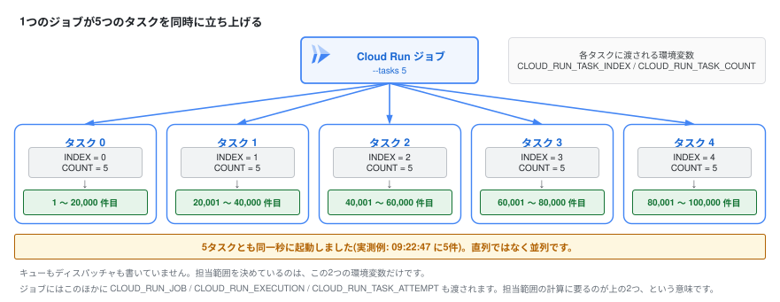

# 10-3. Cloud Run Jobs

ここまで扱ってきたのは Cloud Run の「Service」——HTTPリクエストを受けるワークロードでした。  
もう1つの顔が **Jobs**: リクエストを受けず、処理が終わったら終了するワークロードです。  
バッチ処理、DBマイグレーション、定期集計などに使います。

> **AWSでいうと:** ECS の RunTask、AWS Batch、(15分制限がなければ)Lambda あたりの守備範囲です。

## Service との違い

| | Services | Jobs |
|---|---|---|
| 起動のきっかけ | HTTPリクエスト | 実行命令(手動 / スケジュール / API) |
| 終わり方 | 常に待ち受け | プロセスが exit したら完了 |
| PORT の listen | 必須 | **不要** |
| 実行時間上限 | 60分(リクエストあたり) | **最大7日間**(タスクあたり) |
| 並列実行 | オートスケール | タスク数・並列数を指定(`--tasks`) |
| リトライ | (Pub/Sub等の呼び出し側で) | `--max-retries` で組み込み |

タスクあたり最大7日間という上限は、Lambda の15分と比べると使える場面の広さがよく分かります(重いデータ移行や機械学習の前処理がそのまま乗ります)。

ただし**この7日間は上限であって既定値ではありません**。タスクあたりのタイムアウトは既定で10分で、`--task-timeout` を指定して最大168時間(7日間)まで延ばします。GPUを使うタスクだけは最大1時間です。既定のまま重い処理を流すと10分で打ち切られるので、長時間の Job では必ず明示してください。

重要なのは、**同じイメージ・同じレジストリ・同じ開発体験のまま**、Web とバッチの両方をカバーできることです。

## 1. Job を作って実行する

今日作ったイメージを流用し、起動コマンドだけ上書きして Job にします。

```bash
gcloud run jobs create handson-job \
  --image ${IMAGE}:v3 \
  --region ${REGION} \
  --command node \
  --args "-e,console.log('Hello from Cloud Run Jobs')"
```

実行します。  
`--wait` で完了まで待ちます。

```bash
gcloud run jobs execute handson-job --region ${REGION} --wait
```

ログを見てください:

```bash
gcloud run jobs logs read handson-job --region ${REGION}
```

コンソールの [Cloud Run](https://console.cloud.google.com/run) では「ジョブ」タブに実行履歴・成功/失敗・ログが並びます。

> **成功していれば:** `--wait` を付けた実行は完了まで戻ってこず、`Creating execution...` → `Provisioning resources...done` → `Starting execution...done` → `Running execution...done` を経て `Execution [handson-job-xxxxx] has successfully completed.` で終わります(20〜30秒ほどかかります)。Job 作成時は `Job [handson-job] has successfully been created.` が出ます。`gcloud run jobs list --region ${REGION}` に `handson-job` が並び、ログに `Hello from Cloud Run Jobs` が出ます。
> **詰まったら:** Job の実行は非同期なので、ログはすぐには出そろいません。`--wait` を付け忘れた場合は数十秒待ってから `gcloud run jobs logs read handson-job --region ${REGION}` をもう一度実行してください。`ALREADY_EXISTS` は作成済みという意味なので、そのまま実行のコマンドへ進みます。イメージが見つからないと言われる場合は、`echo ${IMAGE}` が空でないかを確認し、空なら 4章の「0. 環境変数の準備」を再実行してください。`:v3` が存在しない場合は `gcloud artifacts docker images list ${REGION}-docker.pkg.dev/${PROJECT_ID}/${REPO} --include-tags` で push 済みのタグを確認し、そこにあるタグ(`:v1` など)に読み替えて作成コマンドを実行して構いません。作り直したいときは `gcloud run jobs delete handson-job --region ${REGION} --quiet` で消してから、この節の作成コマンドをもう一度実行します。

## 2. 定期実行(cron)にする

Cloud Scheduler(EventBridge Scheduler 相当)から叩けば cron バッチになります。  
コンソールのジョブ詳細画面から「トリガー」→「スケジューラー トリガーを追加」で GUI からも設定できます。

CLI でやる場合は、Scheduler が Job を起動するための**専用サービスアカウント**を作り、必要最小限の権限(`run.invoker`)だけを与えます(AWS で EventBridge Scheduler に実行ロールを作るのと同じ発想です)。

```bash
# Scheduler が Job を起動するための専用サービスアカウント
gcloud iam service-accounts create handson-scheduler

gcloud run jobs add-iam-policy-binding handson-job \
  --region ${REGION} \
  --member "serviceAccount:handson-scheduler@${PROJECT_ID}.iam.gserviceaccount.com" \
  --role roles/run.invoker

# 例: 毎朝9時(JST)に実行するトリガー
gcloud scheduler jobs create http handson-job-schedule \
  --location ${REGION} \
  --schedule "0 9 * * *" \
  --time-zone "Asia/Tokyo" \
  --http-method POST \
  --uri "https://run.googleapis.com/v2/projects/${PROJECT_ID}/locations/${REGION}/jobs/handson-job:run" \
  --oauth-service-account-email "handson-scheduler@${PROJECT_ID}.iam.gserviceaccount.com"
```

> こちらはコマンドが少し長いので、イベントでは GUI での設定を見せるだけで十分です。IAM 付与の直後は反映まで数分かかり 403 が返ることがあります——初回実行が失敗したら少し待ってリトライしてください。

<!-- 引用ブロックの結合を防ぐ区切り -->

> **成功していれば:** `gcloud scheduler jobs list --location ${REGION}` に `handson-job-schedule` が `ENABLED` で並びます。サービスアカウントは `gcloud iam service-accounts list` に `handson-scheduler@...` として出ます。
> **詰まったら:** サービスアカウントと IAM 付与のコマンドは何度実行しても同じ結果になるので(`ALREADY_EXISTS` はそのまま次へ)、順番に再実行して構いません。作成した直後に IAM 付与を実行すると `INVALID_ARGUMENT: Service account handson-scheduler@... does not exist.` で失敗することがあります——これはサービスアカウント作成の反映待ちなので、数十秒おいて IAM 付与のコマンドだけをもう一度実行してください。Cloud Scheduler の API が有効でないというエラーが出た場合は `gcloud services enable cloudscheduler.googleapis.com` を実行してから、スケジューラー作成のコマンドをやり直してください。上記のとおり反映待ちで最初の起動が 403 になることがあるので、Job 自体が動く状態かを確かめたいときは数分待ってから `gcloud run jobs execute handson-job --region ${REGION} --wait` で手動実行が成功するかを見てください。`${PROJECT_ID}` や `${REGION}` が空のままだとメンバー名や URI が壊れるので、その場合は 4章の「0. 環境変数の準備」を再実行してからやり直します。この節は本編の内容ではないので、うまくいかなければコンソールの GUI 設定を見るだけにして次へ進んで構いません。

## 3. 並列実行



Jobs の面白いところは組み込みの並列実行です。  
例えば「10万件のデータを100タスクで分担して処理」のような使い方ができます:

```bash
gcloud run jobs update handson-job --region ${REGION} --tasks 5
gcloud run jobs execute handson-job --region ${REGION} --wait
```

各タスクには `CLOUD_RUN_TASK_INDEX` / `CLOUD_RUN_TASK_COUNT` という環境変数が渡されるので、「自分は何番目か」で担当範囲を割り出せます。  
AWS Batch の配列ジョブ相当が、追加サービスなしで使えます。

> **[要作図] 図10: 並列タスクが担当範囲を分ける仕組み**
>
> - **目的:** `CLOUD_RUN_TASK_INDEX` だけで分担が決まるという、コードを書く側の視点を示す
> - **描き方:** 1つの Job から5つのタスクが同時に立ち上がる形。各タスクの箱に渡される環境変数と、そこから導かれる担当範囲を並べる
>   - タスク0: `INDEX=0` / `COUNT=5` → 1〜20,000件目
>   - タスク1: `INDEX=1` / `COUNT=5` → 20,001〜40,000件目
>   - (以下同様に5つ)
> - **要点:** キューもディスパッチャも書いていないこと。**環境変数2つで分担が決まる**という単純さがこの機能の価値
> - **補足:** 実測では5タスクがほぼ同時(同一秒)に起動した例もあり、直列ではなく並列であることを図でも表現したい(5つの箱を横並びにして同時性を示す)
> - **完成後の扱い:** `10_advanced/imgs/parallel-tasks-index.svg` として保存し、**見出しの直下**に `` として差し込む(見出し → 画像 → 本文の順。キャプション文は付けない)
> - **現在の状態:** 上に差し込まれているのは draw.io で作図した完成図です。SVG に編集元の XML を埋め込んであるため、**このファイルをそのまま draw.io で開いて編集できます**

## 後片付け(この節の分)

```bash
gcloud scheduler jobs delete handson-job-schedule --location ${REGION} --quiet  # 作った場合のみ
gcloud iam service-accounts delete "handson-scheduler@${PROJECT_ID}.iam.gserviceaccount.com" --quiet  # 作った場合のみ
gcloud run jobs delete handson-job --region ${REGION} --quiet
```
